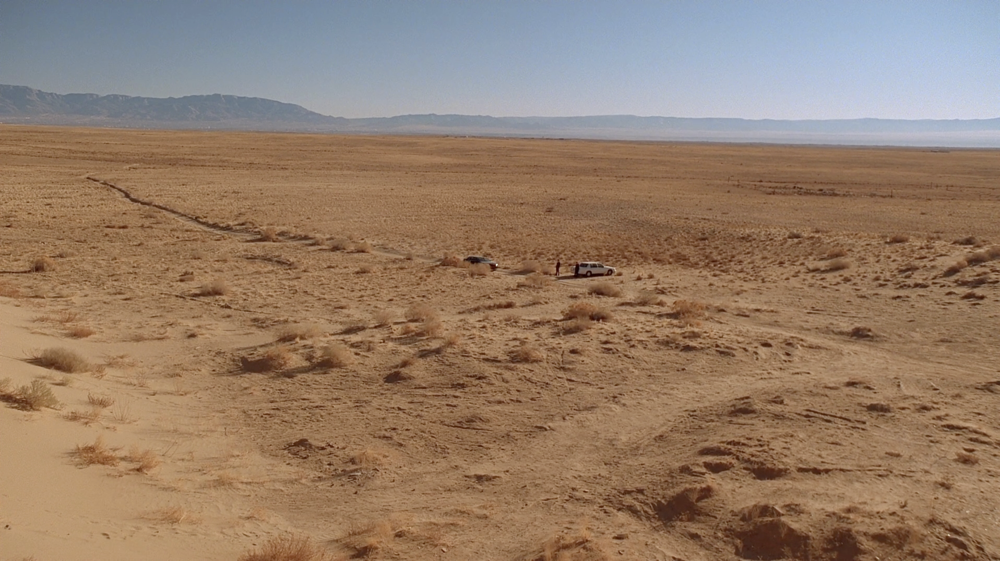

# Phase 1: The Desert {-}

> *The journey of a thousand miles begins with a single step.* — Laozi

](img/2.png)

Phase 1 of any community is best defined as [wandering in the desert](https://www.google.com/url?q=https://medium.com/seeking-wisdom/17-why-startups-are-like-wandering-through-the-desert-c042bfd7edf4&sa=D&source=editors&ust=1675965397286679&usg=AOvVaw3-AnAwf6z21e5htYngExzu). The “community” has three or fewer members. It could also just be you, an idea that isn’t fully fleshed-out yet, and a lot of confusion.

## Setting the Stage {-}

The best thing to do at this stage is to establish key operating behaviours and mental frames of mind that will help you recruit the first believers to your mission.

### Creating a Space {-}

All interactions create a space. The atmosphere of this space is set by the nuances and details of the interaction. Let’s take an example from our daily lives.

The space created when a group of friends get together, is very different from the space created when they meet each other individually. This is because inspite of inhabiting the shared space (as members of a group), their individual interactions have vastly different details and nuances.

When the details and nuances of an interaction is consistent, the space has a constant atmosphere that fosters bonding. When these are inconsistent, we see the breakdown of a group in several sub-groups where interactions are consistent.

By being objective and intentional in your interactions, you increase the chance of maintaining a consistent atmosphere. This has a positive effect that compounds over-time.

### Building a Narrative {-}

Communities exist because they fill a void that members can’t fill themselves. This could be doing something ambitious, feeling seen and heard, exploring interests further, or anything else.

Ambitious goals require teams of people to achieve them. Feeling seen and heard requires attentive ears and a safe space. Exploring interests requires exposure to experts and beginners alike that unlocks new perspectives and a deeper understanding. All of this is only possible in communities, never alone.

A clear narrative easily conveys the value members can expect to get from the community. It also does a great job of setting the right expectations and separating people who are casually interested from those that are genuinely interested.

### Approaching Work {-}

The best way to think about growing a community is raising a child. Everything you teach them needs to be constantly updated and reinforced. Simply saying something once isn’t enough. You must make an effort every single day to emphasise your values till they get embedded in the “space”, and you must prepare and address the needs of today.

This means that your approach to working in your community must be very intentional. Since there is a high chance that your community is mostly online and exists solely in the communication channels, it is imperative to maintain a certain objectivity and clarity in your communications.

## Time to Perform! {-}

### Activity 1: How do you show up to yourself? {-}

> ℹ️ **Creating Spaces** 
>
> Remember, the point of a space is to create an atmosphere that is conducive to operating in and growing your community. This means it starts with you, at the individual level.

The way you show up to yourself and your various roles is the way you show up to your community. Observing yourself as a group and noticing the various interactions is quite revealing. This is evident when you say, “this part of me wants X, but this part of me wants Y.”

* Write down the various parts that make “you”.
    * These could be the roles you play (a friend, a parent, a teacher, etc.)
    * Or your various motivations and desires (I really want to read this book, but I also want to go out with my friends).
* Notice the interactions between these various parts.
    * Are you combative or collaborative? (for example, do you often resolve conflicting desires with harsh words like “No, we will not do this!” or in some other way?)
    * When you favour a certain part, is it out of domination or a place of understanding? (for example, the teacher in you wants to reprimand the disruptive student, but the friend in you wants to laugh at what they said.)
* If there are others in your community at this moment, get everyone to do this exercise individually and share the results with each. It will not only deepen your understanding of each other, but it will also help in communicating better.

### Activity 2: What are you getting people excited about? {-}

> ℹ️ **Building narratives** 
>
> A strong narrative is like insurance. Its true value revealed in dire times. A good narrative keeps community members intrinsically motivated and attracts new members at the same time.

*“If you want to build a ship, don’t drum up the men to gather wood, divide the work, and give orders. Instead, teach them to yearn for the vast and endless sea.”* — Antoine de Saint-Exupéry

* Ideally, you want your community to grow because there is something you cannot do alone. What is this? Create a one-line summary that explicitly states your goals and motivations.
    * “I want to be surrounded by people that share my niche interest of X.”
    * Now imagine for a minute that you successfully gathered these kind of people. What kind of work wil    l you do together? What will that lead to?
        * “A group of people that share this interest will get together and A, B and C activities, that will have a P, Q and R effect on the world.
    * The effect you will have on the world becomes your narrative.
        * So, if I am surrounded by people that share my niche interest in Pokemon, then we shall participate in and conduct events, fund relevant projects and contribute to the franchise by creating content. This will introduce a wider audience to our interest, and provide them with community and entertainment.
    * The above, distilled into your narrative becomes — we are expanding the pokemon fandom around the world.
    * Remember, the best narratives evolve with community participation. So while you must put in some thought, do not spend too much time here. There is a high chance that as your community grows, it will collectively decide to focus on something that slightly different, or even completely different.

### Activity 3: Spreading the word. {-}

Now that you have clarity, create a content strategy that revolves around your narrative and start posting on Twitter, Lens and Farcaster to begin with.

### Activity 4: How do you participate in your community? {-}

> ℹ️ **Working smart** 
>
> Setting a healthy, intentional approach to working goes a very, very long way. It is indeed tempting to “just get it done” when it’s just you or you and a couple others. But not spending time on this is like extending a line of credit which will be due once your community grows.
Having said that, it’s the early stages, so clarity and brevity is important. Making a laundry list of rituals, values and processes will backfire, and dilute any existing motivation you have. It is therefore ideal to stick to just a few — think really hard about what you care about — and then be open to changing or adding to these as your community grows.

* Discover the core value(s) of your community.
    * Everyone and every group has some set of values that they never compromise on. These could be explicit or implicit. Try to notice the patterns in yourself and those around you.
        * Do you try to finish things as soon as you can? Are you over-communicative in your interactions? Do you try to be thorough in everything you do? Do you tolerate ambiguity well?
    * It is easier to notice the patterns in others than yourself. If it’s just you right now, ask your friends and families about ways to describe you.
* Consciously set rituals.
    * Rituals bring a sense of stability to a community. Good rituals make members feel heard, and indirectly direct member behaviour.
    * Ideally, you should an initiation ritual and a connection ritual.
    * Initiation rituals define how you welcome new members to your community. Ideally, this should be a two-way interaction. For example, new members must collect a Mirror post and introduce themselves to the group collectively. On the other side, all members must make an effort to individually reach out to the new member.
    * The best initiation rituals are memorable. For example, you could have all your existing members change their Twitter profile picture to that of the new member for a week. Who said it can’t be fun?
    * A connection ritual bonds community members outside of the context of “work”.
* Good connection rituals manage expectations of members. This could be a weekly call where members take turns to share what’s on their mind —
    * Did anything unexpected happen in your interactions this week?
    * is there something insignificant that is bothering you? Maybe the way someone replied or something they did that is trivial but made you make a note of it.
    * Was participating in this community this week an exciting challenge or a daunting task?

### Activity 5: Create your manifesto. {-}

* Your community narrative and your values make up your manifesto. If you have done the above exercises diligently, it won’t take long to prepare this.
* Next, create a collectable Mirror post of this manifesto (ideally free) and personally send it to all your existing Twitter followers.

## Common Roadblocks {-}

[For the love of the immortal snail](https://www.google.com/url?q=https://www.oxfordstudent.com/2021/11/03/for-love-of-the-immortal-snail/&sa=D&source=editors&ust=1675965397292817&usg=AOvVaw0W_Y3qcJT8RtyUWGVdDTtz)

Communities in the beginning are ideas, and ideas die a slow death. Keeping your community alive requires consistent effort to keep the idea alive. This is harder than it seems.

When there’s just one, two or three people, everyone’s behaviours and outlook has an outsized impact on the team’s motivation. The good days are really good and the bad days are really bad. So all challenges in this stage pertain to maintaining motivation.

The only way to navigate this phase thus is to rigorously uphold your values, and religiously take part in rituals. This will ground you and help you maintain a baseline level of motivation to keep the idea alive at all times.

Take an iterative approach to everything and focus on doing good enough instead of doing perfect. Iterations just feel good, and keep the morale high. Think of it like taking the stairs vs. jumping directly. The latter is no doubt faster, and sometimes more fun, but it might break your legs, and is definitely not a strategy for the long run..

## Conclusion {-}

By now, you should have set the stage to spread your mission and recruit early believers. You have a clear idea of what you are doing and a sustainable, healthy way of working and growing your community. You also have a tiny presence on social media (like Twitter, Farcaster and Lens) and a manifesto that introduces the world to your community.

Hopefully, the bedrock of your community strengthens over time and you chip off at work, one day at a time, one task at a time. Eventually, there comes a point when your team starts growing. You slowly double in size and reach a team of five or six people. Things change — some for the better, some for the worse — and you need to keep up with this. Let’s learn how.